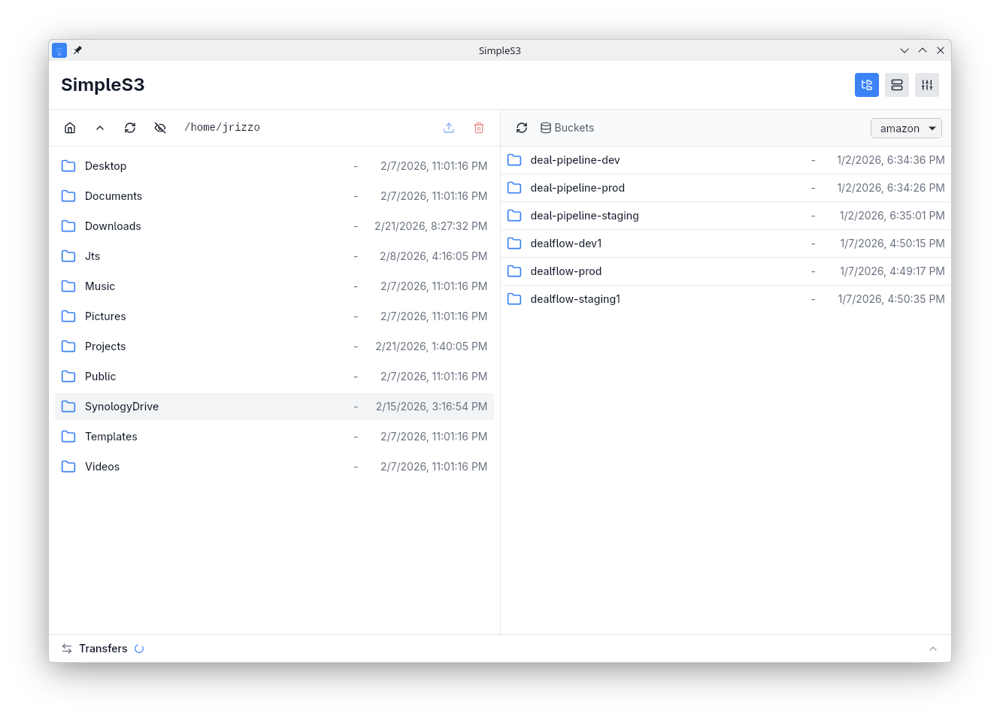

# SimpleS3

A simple, cross-platform desktop client for browsing and managing files on S3-compatible storage. Built with [Tauri v2](https://v2.tauri.app/) and Rust.

<p align="center">
  
</p>

<!-- Add a screenshot here:  -->

## Features

- **Dual-pane file browser** — local filesystem on the left, S3 on the right
- **Multiple S3 endpoints** — connect to AWS S3, MinIO, Backblaze B2, Cloudflare R2, or any S3-compatible service; switch between them instantly
- **Secure credentials** — access keys are stored in your OS keychain (macOS Keychain, Windows Credential Manager, Linux Secret Service)
- **Transfer queue** — upload and download files with pause, resume, and cancel support
- **Multipart transfers** — large files (>100 MB) are transferred in parts automatically
- **Dark mode** — follows your system theme or can be set manually
- **Keyboard shortcuts** — F5 to refresh, Delete to delete, Ctrl+U to upload, Ctrl+D to download
- **Offline detection** — active transfers are paused automatically when network connectivity drops and resumed when it returns

## Install

Download the latest release for your platform from the [Releases](../../releases) page:

| Platform | Format |
|----------|--------|
| Linux    | `.deb`, `.AppImage` |
| Windows  | `.msi`, `.exe` (NSIS) |
| macOS    | `.dmg` |

## Development Setup

### Using devenv (NixOS / Nix)

The recommended way to set up the development environment is with [devenv](https://devenv.sh/). This handles all system dependencies automatically.

```bash
# Enter the dev shell (installs Rust, Bun, Tauri CLI, GTK, WebKitGTK, etc.)
devenv shell

# Install frontend dependencies
bun install

# Start the app in development mode
dev
# — or equivalently —
bun run tauri dev
```

devenv also provides these helper scripts:

| Command | Description |
|---------|-------------|
| `dev` | Install deps and launch the app |
| `build` | Production build |
| `test` | Run Rust and frontend tests |
| `lint` | Run clippy and eslint |
| `format` | Auto-format Rust and TypeScript |
| `check` | Format check + lint + test |
| `clean` | Remove build artifacts |

### Manual Setup

If you are not using Nix, install the following prerequisites:

1. **Rust** 1.75+ — <https://rustup.rs/>
2. **Bun** — <https://bun.sh/>
3. **Linux system libraries** (Linux only):
   ```bash
   sudo apt-get install -y \
     libgtk-3-dev libwebkit2gtk-4.1-dev libappindicator3-dev \
     librsvg2-dev patchelf libsoup-3.0-dev \
     libjavascriptcoregtk-4.1-dev libssl-dev
   ```

Then:

```bash
bun install
bun run tauri dev
```

### Building for Production

```bash
bun run tauri build
```

Build artifacts are written to `src-tauri/target/release/bundle/`.

## Project Structure

```
simples3/
├── src/                    # Frontend (React + TypeScript)
│   ├── components/         # UI components
│   ├── contexts/           # React contexts (clipboard)
│   ├── hooks/              # React hooks (theme, network)
│   ├── styles/             # CSS / Tailwind
│   ├── types/              # TypeScript type definitions
│   ├── App.tsx             # Main application component
│   └── main.tsx            # Entry point
├── src-tauri/              # Backend (Rust + Tauri)
│   ├── src/
│   │   ├── commands/       # Tauri IPC commands
│   │   ├── models/         # Data models
│   │   ├── services/       # S3, config, transfer logic
│   │   └── lib.rs          # Library root
│   ├── Cargo.toml          # Rust dependencies
│   └── tauri.conf.json     # Tauri configuration
├── devenv.nix              # Nix dev environment
└── README.md
```

## Testing

```bash
# Rust tests
cd src-tauri && cargo test

# Frontend tests
bun test

# Linting
cd src-tauri && cargo clippy
bun run lint
```

### Local S3 Testing with MinIO

[MinIO](https://min.io/) provides an S3-compatible server you can run locally:

```bash
mkdir -p ~/minio-data
minio server ~/minio-data --console-address ":9001"
```

Default credentials: `minioadmin` / `minioadmin`. Add a new endpoint in SimpleS3 pointing to `http://localhost:9000`.

## Contributing

Contributions are welcome! Please open an issue or pull request.

1. Fork the repository
2. Create a feature branch (`git checkout -b my-feature`)
3. Commit your changes
4. Push to your fork and open a pull request

## License

SimpleS3 is licensed under the [GNU General Public License v3.0](LICENSE.md).
